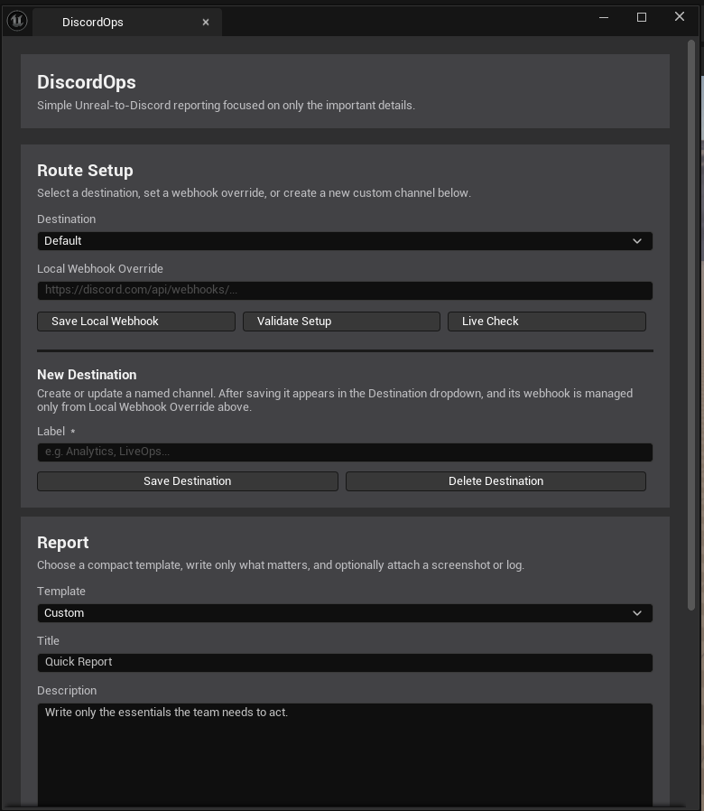
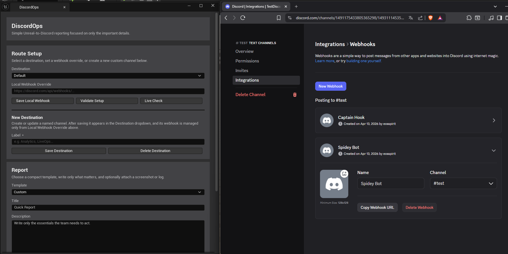
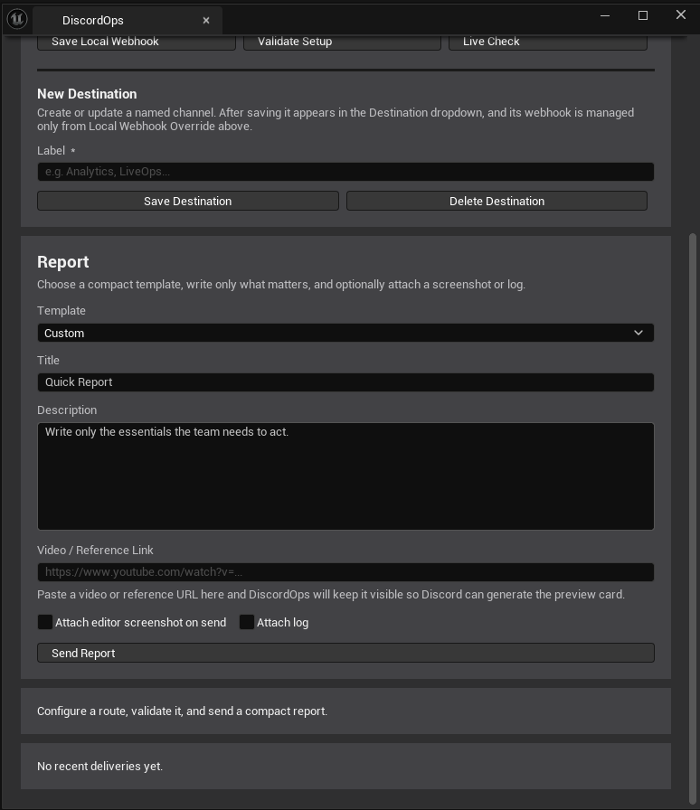
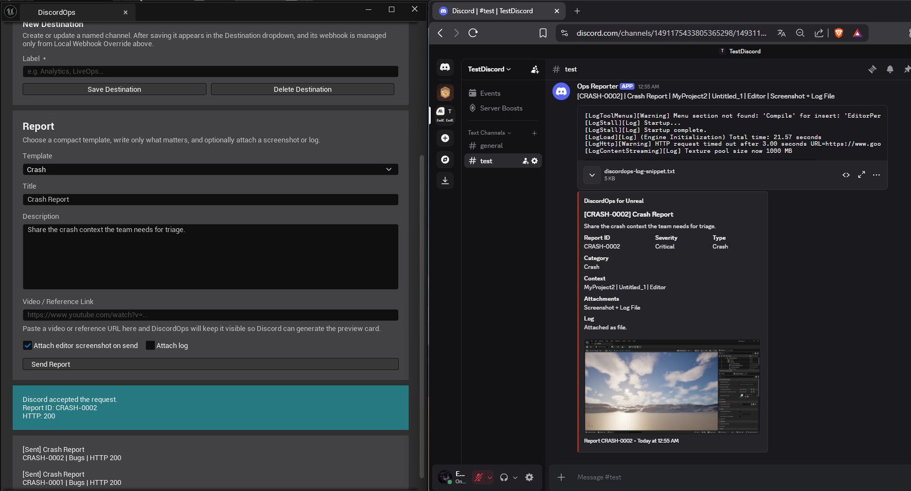

# Installation Guide

This guide shows the current DiscordOps installation and first-time setup flow using the compact editor panel and Discord webhooks.

## Validated release target

`DiscordOps for Unreal` is currently validated for:

- `Unreal Engine 5.7`
- `Win64`

## 1. Install the plugin

If you are using the marketplace release:

1. Install `DiscordOps for Unreal` from `Fab` or the Epic Games Launcher for your Unreal Engine version.
2. Open your Unreal project with that engine version.
3. Go to `Edit > Plugins`.
4. Search for `DiscordOps`.
5. Enable the plugin if it is not already enabled.
6. Restart the editor if Unreal asks for it.

If you are installing from source instead:

1. Close Unreal Editor.
2. Copy the plugin folder into `YourProject/Plugins/DiscordOps`.
3. Open the `.uproject`.
4. If Unreal asks to compile the plugin, allow the build to complete.

After the plugin loads, verify that you can open:

- `Window > DiscordOps`

## 2. Open the DiscordOps panel

Open the panel from:

```text
Window > DiscordOps
```

The current UI is split into three parts:

- `Route Setup`
- `New Destination`
- `Report`

<figure>
  
  <figcaption>The compact panel keeps setup, destination management, and reporting in one place.</figcaption>
</figure>

## 3. Create a Discord webhook

In Discord, open the target channel and go to:

```text
Channel Settings > Integrations > Webhooks
```

Create a webhook for the channel that should receive the reports, then copy the webhook URL.

The screenshot below shows the webhook page in Discord and the matching route setup flow in DiscordOps.

<figure>
  
  <figcaption>Create the webhook in Discord, then paste that URL into <code>Local Webhook Override</code> inside Route Setup.</figcaption>
</figure>

## 4. Save the webhook in DiscordOps

Inside `Route Setup`:

1. Choose the destination you want to configure.
2. Paste the webhook into `Local Webhook Override`.
3. Click `Save Local Webhook`.

Important behavior:

- `Default`, `QA`, and `Bugs` can each use their own local webhook
- custom destinations are created first in `New Destination`
- after creating a custom destination, its webhook is assigned from `Local Webhook Override`
- a custom destination without its own webhook is treated as not configured and does not fall back to the default route

## 5. Validate the selected route

After saving the webhook:

1. Click `Validate Setup`
2. Optionally click `Live Check`

This confirms that the selected route is configured before you send a real report.

## 6. Create custom destinations when needed

If you want a dedicated route such as `Analytics`, `LiveOps`, or another internal channel:

1. Enter the name in `New Destination > Label`
2. Click `Save Destination`
3. Select the new destination in `Route Setup`
4. Paste its webhook into `Local Webhook Override`
5. Click `Save Local Webhook`

## 7. Fill the report and send it

Use the `Report` section to prepare the message:

- `Template`
- `Title`
- `Description`
- `Video / Reference Link`
- `Attach editor screenshot on send`
- `Attach log`

<div class="doc-gallery">
  <figure>
    
    <figcaption>Fill only the essentials: template, title, description, optional link, and optional attachments.</figcaption>
  </figure>
  <figure>
    
    <figcaption>The final Discord message stays compact while still carrying the screenshot and recent log snippet.</figcaption>
  </figure>
</div>

When the route is ready:

1. Fill the report fields
2. Click `Send Report`

## Security notes

- Do not commit real `Webhook URL`, `Bot Token`, or sensitive channel IDs
- use local overrides or non-tracked local config for private credentials
- clear personal webhooks before packaging a release build or Fab upload
